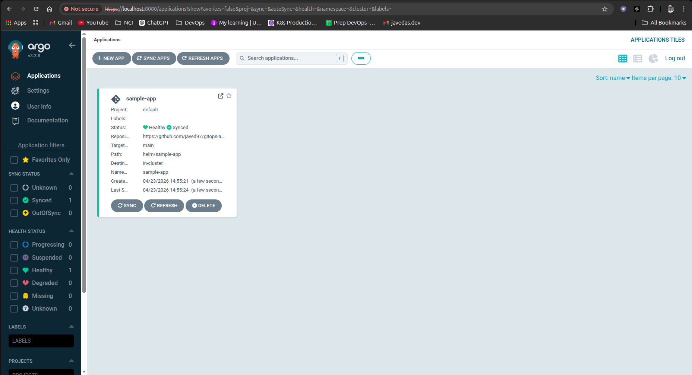
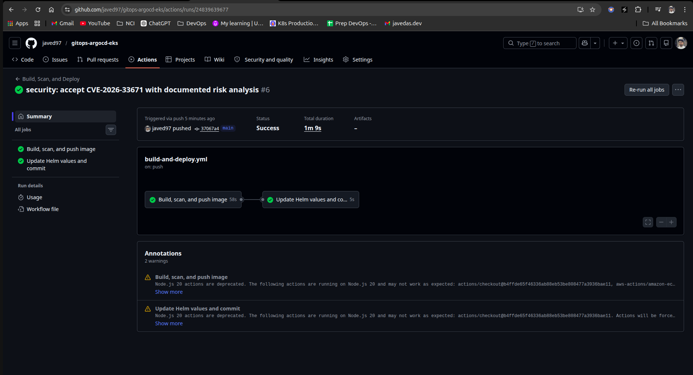
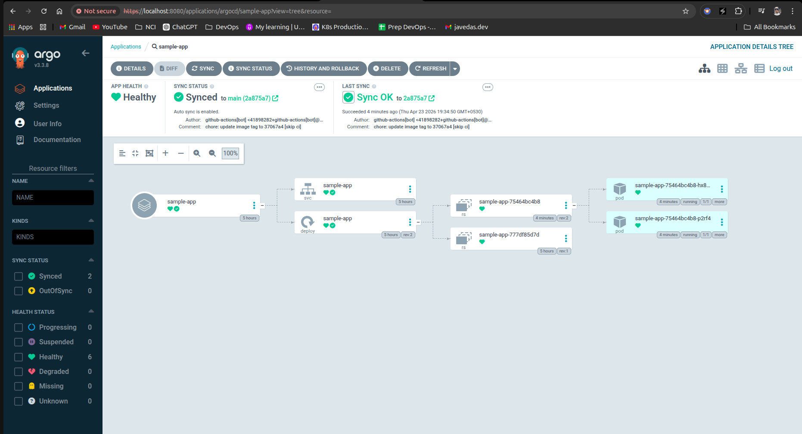
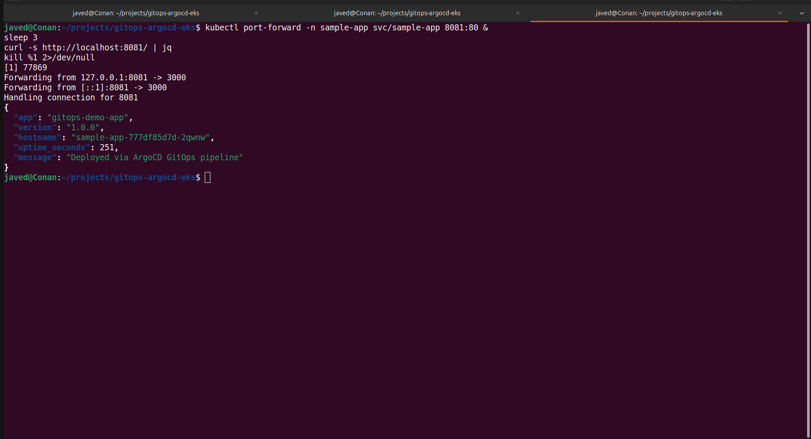
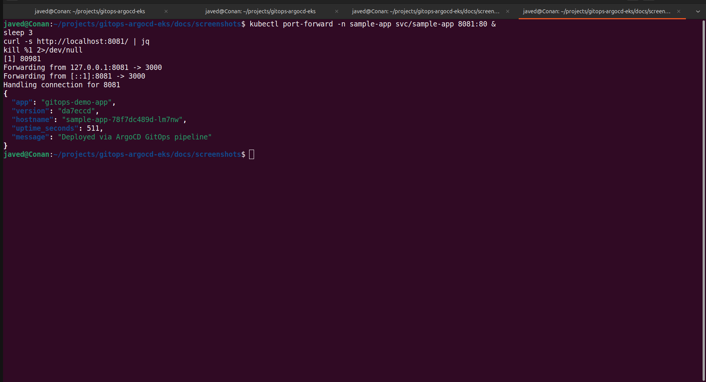

# GitOps pipeline on EKS with ArgoCD

A working example of a GitOps deployment pipeline on AWS EKS. Push code, a GitHub Actions workflow builds and scans a container image, pushes it to ECR, commits the new image tag back to Git, and ArgoCD rolls it out to the cluster. The cluster itself is provisioned with Terraform. Nothing about deployments is done by hand — Git is the source of truth.

## What's in the repo

```
terraform/              VPC, EKS cluster, node group, ECR repo
app/                    Node.js demo app with /, /healthz, /metrics
helm/sample-app/        Helm chart that ArgoCD deploys
argocd/                 ArgoCD Application manifest
iam/                    IAM policies for OIDC
.github/workflows/      CI/CD pipeline
docs/screenshots/       Screenshots referenced below
```

## Architecture



Worker nodes run in private subnets behind a NAT gateway with no public IPs. GitHub Actions authenticates to AWS via OIDC — no long-lived access keys stored anywhere. The IAM role has permissions only on the single ECR repo for this project.

## How the pipeline works

A push to `main` under `app/` or `helm/sample-app/` triggers the workflow:

1. Assume the ECR-push IAM role via OIDC
2. Build the Docker image, tag with the 7-character commit SHA
3. Scan with Trivy — build fails on HIGH/CRITICAL CVEs with available fixes. Accepted exceptions live in `app/.trivyignore` with written justifications.
4. Push image to ECR
5. A second job rewrites `helm/sample-app/values.yaml` with the new tag and commits it back with `[skip ci]` in the message
6. ArgoCD polls every 3 minutes, detects the change, re-renders the chart, and Kubernetes does a rolling update





## Running this yourself

Prerequisites: an AWS account with admin, plus `terraform`, `kubectl`, `helm`, `aws` CLI v2, and `docker`.

Provision infra:

```bash
cd terraform
terraform init
terraform apply
```

Point kubectl at the cluster:

```bash
aws eks update-kubeconfig --region ap-south-1 --name gitops-eks-cluster
```

Install ArgoCD:

```bash
kubectl create namespace argocd
kubectl apply -n argocd -f https://raw.githubusercontent.com/argoproj/argo-cd/stable/manifests/install.yaml
kubectl wait --for=condition=available --timeout=300s deployment --all -n argocd
```

Wire up GitHub OIDC to AWS (one-time per AWS account):

```bash
aws iam create-open-id-connect-provider \
  --url https://token.actions.githubusercontent.com \
  --client-id-list sts.amazonaws.com \
  --thumbprint-list 6938fd4d98bab03faadb97b34396831e3780aea1
```

Create the IAM role from the policies in `iam/` (edit the repo reference first), add `AWS_ROLE_ARN`, `AWS_REGION`, and `ECR_REPOSITORY` as GitHub Actions variables, and set workflow permissions to read/write.

Update `helm/sample-app/values.yaml` and `argocd/application.yaml` to point at your fork and ECR URL, then:

```bash
kubectl apply -f argocd/application.yaml
```

Verify:

```bash
kubectl port-forward -n sample-app svc/sample-app 8081:80 &
curl -s http://localhost:8081/ | jq
```

## Rollback

Rollback is a single `git revert`. ArgoCD reconciles the cluster to whatever Git says.

```bash
git revert HEAD --no-edit
git push origin main
```

Within the sync interval the cluster is back on the previous version.





## Problems I hit while building this

**EKS node group failed on first apply.** Fresh AWS accounts don't have the EKS service-linked role created until the first cluster tries to use it. Terraform errored with `AccessDenied: Amazon EKS Nodegroups was unable to assume the service-linked role`. Fix was one command: `aws iam create-service-linked-role --aws-service-name eks-nodegroup.amazonaws.com`, then re-run apply.

**Trivy kept flagging CVE-2026-33671 in picomatch despite my lockfile not containing it.** I spent a while assuming the Buildx cache was serving stale `npm install` layers — adding `no-cache: true` proved it wasn't. The real behaviour was that `npm ci` on the Ubuntu runner resolved picomatch into the dependency tree even though the same command on my laptop didn't. I triaged the CVE instead of fighting the resolver: it's a ReDoS in glob matching, and this app has three endpoints, none of which accept glob input from users. I added it to `app/.trivyignore` with a written justification and a review date. The decision-making matters more than the outcome — in a real job I'd raise the same exception with the same reasoning.

**Rollback looked like a no-op on my first attempt.** I reverted the bot's `[skip ci]` tag-bump commit, but the tag it reverted *to* happened to be the same tag the cluster was already running. ArgoCD correctly identified no drift and did nothing. Useful reminder that ArgoCD reconciles to manifest content, not commit identity.

## What I'd do differently

A production setup would split the app repo and the config repo. The pipeline here commits back to the same repo it builds from, which works for a solo project but doesn't scale in a team.

I'd also move from polling to webhook-based sync — ArgoCD supports it, which would drop deploy time from "within 3 minutes" to "within seconds".

The Trivy gate only covers container image scanning. A fuller setup would also scan Terraform (Checkov or tfsec), the Helm chart (kube-linter), and dependency licenses.

## Cost notes

Running this on AWS is not free. Rough figures:

- EKS control plane: $0.10/hour (~$73/month)
- 2× t3.small worker nodes: ~$0.04/hour
- NAT gateway: $0.045/hour

Total: roughly $0.20/hour. I provisioned, built everything out over two days, destroyed with `terraform destroy`, and spent under ten dollars. Don't leave it running.

```bash
cd terraform
terraform destroy
```

## License

MIT. See LICENSE.
